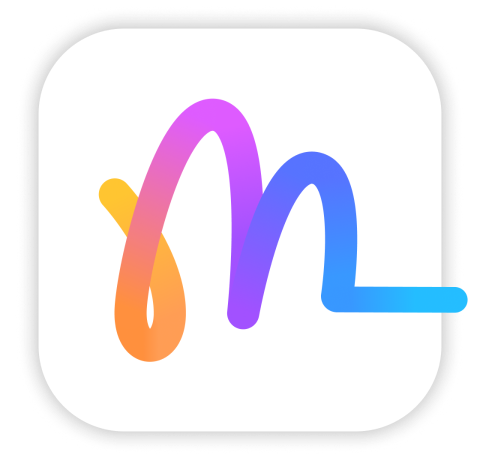

<div align="center">
    
    <h1>
        Memola
    </h1>
    <div>
        <a href="https://apps.apple.com/app/memola/id6738171174">
            
        </a>
        <a href="https://apps.apple.com/app/memola/id6738171174">
            
        </a>
    </div>
</div>
<br>

**Memola** is an open-source note-taking application, fully built using the Metal framework, allowing you to seamlessly jot down ideas and sketch your visions across iOS, iPadOS, and macOS.

<p align="center">

</p>

---

## 🚀 Tech Stack

**Memola** uses the following technologies:

- **Metal** for high-performance rendering.
- **SwiftUI** for building the user interface.
- **Combine** for reactive programming.
- **Swift Concurrency** for handling asynchronous tasks.
- Additional libraries: **BezierKit**, **FastDraw**, **rbush**, **RTree**, and more.


---

## 🛠️ Project Setup

### Prerequisites:
- Xcode 12 or higher
- macOS 10.15 or higher

### Steps to Build:
1. Clone the repository to your local machine:
    ```bash
    git clone https://github.com/dscyrescotti/Memola.git
    ```
2. Navigate into the project directory and open it in Xcode:
    ```bash
    cd Memola
    xed .
    ```
3. Build and run the project using `⌘R` in Xcode on a real device.

---

## 👨‍💻 Contributions
**Memola** welcomes all developers to contribute if you have any idea to enhance and open an issue if you encounter any bug.
To get started, follow these steps:

1. **Fork** the repository to your own GitHub account.
2. **Clone** your fork to your local machine:
    ```bash
    git clone https://github.com/YOUR-USERNAME/Memola.git
    ```
3. Create a **new branch** for your changes:
    ```bash
    git checkout -b feature/your-feature-name
    ```
4. **Commit** your changes:
    ```bash
    git commit -m "Add feature: description of the feature"
    ```
5. **Push** your changes:
    ```bash
    git push origin feature/your-feature-name
    ```
6. Open a **Pull Request** to the main repository.

---

## 🙇 Credits
- [BezierKit](https://github.com/hfutrell/BezierKit)
- [FastDraw](https://github.com/collinzrj/FastDraw)
- [hand-drawing-swift-metal](https://github.com/owengombas/hand-drawing-swift-metal)
- [ios_metal_bezier_renderer](https://github.com/eldade/ios_metal_bezier_renderer)
- [MaLiang](https://github.com/Harley-xk/MaLiang)
- [MetalPaint](https://github.com/rydermackay/MetalPaint)
- [MetalScroller](https://github.com/chunkyguy/MetalScroller)
- [Metal2DScrollable](https://github.com/codelynx/Metal2DScrollable)
- [rbush](https://github.com/mourner/rbush)
- [RTree](https://github.com/imbcmdth/RTree)
- [Sketch](https://github.com/daihase/Sketch)
- [THST](https://github.com/tuxalin/THST)

---

## © License
**Memola** is available under the MIT license. See the [LICENSE](/LICENSE) file for more info.
